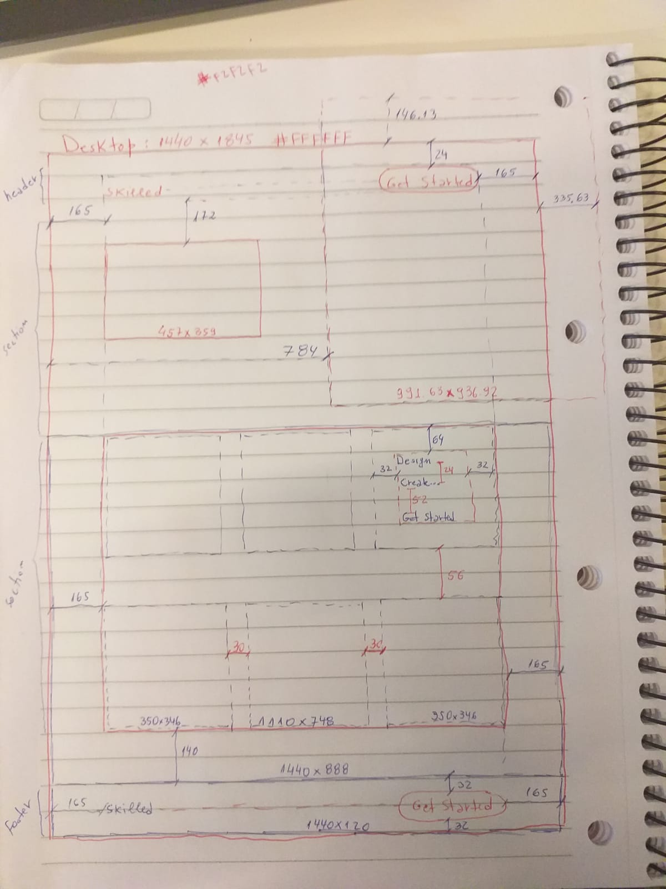

# Frontend Mentor - Skilled e-learning landing page solution

This is a solution to the [Skilled e-learning landing page challenge on Frontend Mentor](https://www.frontendmentor.io/challenges/skilled-elearning-landing-page-S1ObDrZ8q). Frontend Mentor challenges help you improve your coding skills by building realistic projects.

## Overview

### The challenge

Users should be able to:

- View the optimal layout depending on their device's screen size
- See hover states for interactive elements

### Screenshot


### Links

- Solution URL: [Frontend Mentor](https://unique-donut-d1413e.netlify.app/)
- Live Site URL: [Netlify](https://unique-donut-d1413e.netlify.app/)

## My process

### Built with

- Semantic HTML5 markup.
- CSS custom properties.
- Flexbox.
- CSS Grid.
- No frameworks (only pure HTML and CSS 🏅).

### What I learned

Let me make some remarks about the challenges faced and lessons learned.

- It took me a few days trying to dissect the design in Figma and plan the solution using pencil and paper. I produced this schematic as a result of that.


- The colors used in the design made this process very difficult, as they are very subtle. The background color in the course grid is very confused with the white color. I often had to increase the contrast in Figma to be able to see the different colors present in the design.

```css
.courses {
  ...
  background: linear-gradient(#FFFFFF, #F0F1FF);
}
```
- It took me a few days to reproduce the exact effect on the image (image-hero-desktop.png). Being more specific: (a) define its size, (b) position it correctly and (c) cut it to the exact size. I had to learn to play with Crohme's development tools to exhaustion in order to reproduce the design. This applies not just to the images but to the design as a whole.

- To crop it I used this [article](https://uploadcare.com/blog/how-to-crop-an-image-in-css/) which helped me understand the technique used. 

```css
.hero img {
  ...
  object-fit: none;
  object-position: left bottom;
  ...
}
```

- It was very challenging to correctly design the course listing using grid. To get the exact dimensions it is critical to inspect the design provided in Figma in detail. And reproducing in code with perfect alignment was quite challenging. Being more specific to position the "Get Started" link I looked for a function in flexbox that doesn't exist: justify-self. Reading this [article on MDN](https://developer.mozilla.org/en-US/docs/Web/CSS/CSS_Box_Alignment/Box_Alignment_in_Flexbox) **I came to understand why there is no justify-self in Flexbox**. The article explains what should be done in this case: use automatic margins in the child elements of a flex container.

```css
.course a {
  ...
  /* The automatic top margin occupies all free space in the flex container. */
  margin-top: auto;
}
```

- I also encountered challenges with the different left margins of page sections. The footer takes up all the horizontal space on the screen, while the other sections are limited to the width provided for the desktop (1440px width).

- Some icons in SVG didn't appear correctly. I had to convert them to png and the problem was solved.

- Lastly, I had to bring the first button (in the header) to the front of the image in order to trigger the :hover event.

- All of this involved a lot of learning and experimentation (trial and error). You have to be patient at this stage because the speed of development drops to practically zero. These challenges were great for revealing the knowledge gaps I had.

### Useful resources

- [Responsive design](https://developer.mozilla.org/en-US/docs/Learn/CSS/CSS_layout/Responsive_Design) - Responsive web design (RWD) is a web design approach. It's not just about technology. This article helped me understand that.
- [How to crop an image in CSS](https://uploadcare.com/blog/how-to-crop-an-image-in-css/) - This article helped me manipulate the images to meet the design requirements.
- [Box alignment in Flexbox](https://developer.mozilla.org/en-US/docs/Web/CSS/CSS_Box_Alignment/Box_Alignment_in_Flexbox) - Detailed explanations of alignment options using Flexbox.

## Author

- LinkedIn - [Abilio Assis](https://www.linkedin.com/in/abilio-assis/)
- Frontend Mentor - [@abilioassis](https://www.frontendmentor.io/profile/abilioassis)
